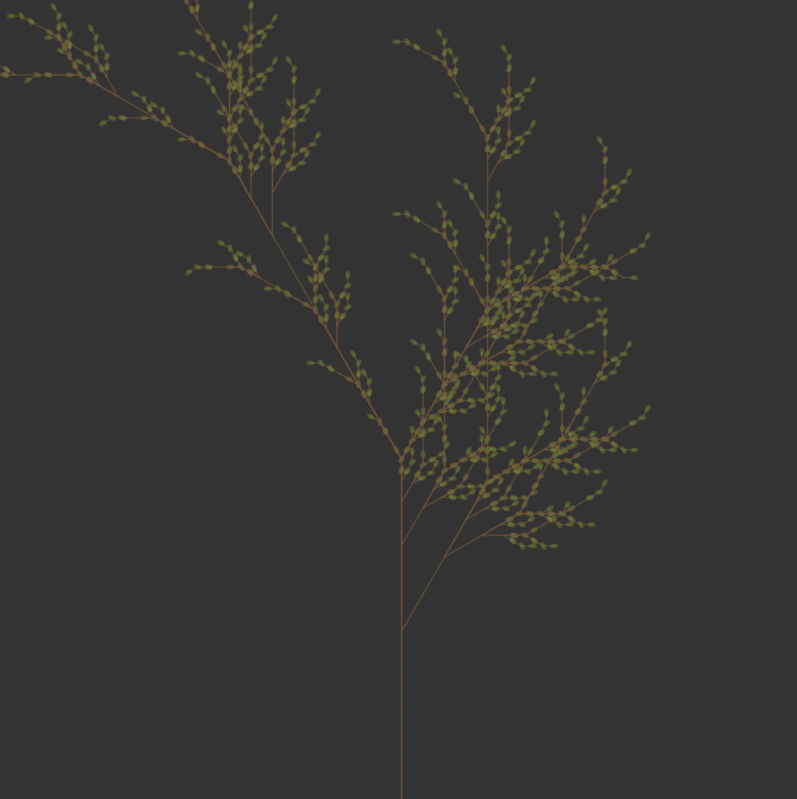

# perlinnoiseandtrees

# L-System Fractals

This repository contains implementations of L-system fractals using p5.js. L-systems are a formal grammar system used to model the growth of plants and fractals.

## Sierpinski Triangle

I think this one is created in other ways. But I learned that we can use L-Systems to make the triangle

## Tree with Leaves

Basic tree. If you add ellipses at the end, it looks like tree with leaves. 

## Basic Tree

Just a bunch of lines that branch and look like a weird tree. 

### How to Run

Simply open the respective `index.html` file in a web browser to view the generated fractals. The p5.js library is included in the repository for convenience.

Feel free to explore and modify the code to create different variations of the fractals.

## Acknowledgments

- The L-system concept is widely used in computer graphics and biological modeling.
- The p5.js library simplifies the process of creating visualizations and interactive graphics in the browser.
- Daniel Shiffman, the best teacher: https://www.youtube.com/@TheCodingTrain

## License

This project is licensed under the MIT License - see the [LICENSE.md](LICENSE.md) file for details.
